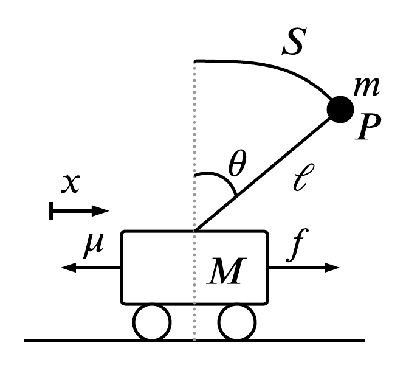

# Controls: Inverted Pendulum Stability Analysis

Here we consider the stability analysis of an inverted pendulum atop a moving cart. The mission is to move the the cart from point A to point B without destabolizing the pendulum.

Note: This means the cart must correct is't navigation to drive the pendulum back to vertical equilibrium once it starts to destabolize.

  

## Problem Constraints

The problem requires:

1. To be considered stable, the pendulum must be within 0.28 degrees from vertical equilibrium.
2. The cart must reach its destination and stabilize the pendulum in less than 5 seconds.
3. The cart must cover at least 90% of the distance to its destination in 0.5 seconds.
4. The pendulum's displacement from vertical equilibrium cannot exceed 20 degrees.

## Procedure  

Our analysis convers the dynamic model generation, PID, full-state feedback and LQR control.

We demonstrate that PID and full-state controlers are insufficient to solve the problem either within the constraints (for the PID scenario) or within an excees of energy (For the full-state feedback controller).  

## Table Of Contents

- Inverted_Pendulum_Stability_Report.pdf
  - Full Analysis Report
- StabilityAnalysis.m
  - MATLAB scipt to generate results

## Abstract  

Chaotic and unpredictable behavior can be a fundamental element of real-world events and thereby a
unique challenge is posed to mathematical modeling and controls specialists. Specifically, the response
of these systems is largely suspect to their initial conditions and small mechanical variations during
operation. Which can drastically impact the expected response. Therefore, building models to describe
the behavior of more complicated networks can reveal methods to control the response of chaotic systems.
As a result we consider a particular problem which places an inverted vertical pendulum on a moving cart.
Such that, an input force is applied to the cart which causes both the cart to move and the pendulum
to oscillate. Specifically, we approach a comprehensive dynamic model of both the motion of the cart
and the position of the pendulum center of mass. Additionally, we allow real world constraints to our
model and attempt to stabilize the theoretical adaption of the physical system under some characteristic
parameters. Ultimately, leading to a method of designing a controller capable of stabilizing both the
carts position and the pendulums center of mass.

## Results

We considered a complex oscillatory system that easily becomes unstable. Such that a pendulum is
balance in vertical position on-top a moving cart. Specifically, we desired to be able to control the
motion of the cart to ensure the pendulum stays at vertical equilibrium and the cart be able to reach
some final destination. Importantly, our study included designing dynamic equations of both the carts
positions and the center of mass of the pendulum, creating a SIMO model. This was done using
the Lagrangian techniques and therefore, was expected to be consistent with normal forced oscillatory
motion. Which was demonstrated by equations (28)(29).
Additionally, we considered the affect on the pendulum of an impulse voltage input to the driving motor
(pushes the cart). Specifically, we designed a PID controller capable of stabilizing the pendulum to
vertical equilibrium after the impulse. PID coefficients were found, kp = 80, ki = 1, kd = 20 which
resulted in a maximum overshoot of Mp < 0.05 or within system parameter requirements. Now to
better facilitate the SIMO design, the controller responsible for both moving the cart and stabilizing
the pendulum was built from state space models. Importantly, this involved ensuring the system was
controllable by some transition matrix. We verified this by showing the controllability matrix Mc spans
the state space or has full rank. equation (40). Therefore, we found matrix A, B, C, D related to
the state-space form that is capable of positioning the system poles anywhere in the s-plane. This is
demonstrated in figure 5.
Therefore, is must be possible to theoretically satisfy any response parameters involving any of the
states. However, with more demanding poles positions the work done by the controller unit (or the
driving motor in this case) grows potentially to large to achievable by the physical system. Therefore, a
LQR controller is used to balance the work done by the controller and the desired response of the system.
figure 6,7. Then applying a step input to the cart at 0.4µ(t) we desired the cart to move 0.4m to the right
of its current position, while stabilizing the pendulum. The closest result to the system requirements is
shown in figure 7, such that in the transient portion of the carts motion it directly attempts to counter-
act the motion of the pendulum, then gradually moves to 0.4m. Which is consistent with the expected
behavior of the system.
11
